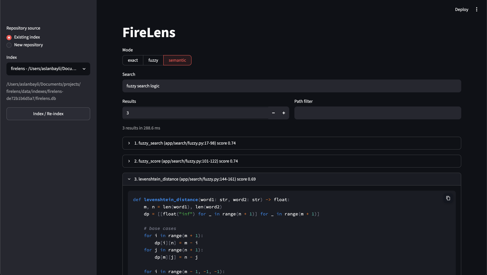

# FireLens

FireLens is a local-first code retrieval engine for Python repositories.

It indexes repository symbols, semantic chunks, and embeddings into SQLite so
code can be retrieved with exact, fuzzy, or natural-language semantic search.
FireLens is not a chatbot. Retrieval and indexing are the product.

## Current scope

- Python-only parsing via the standard library `ast` module
- SQLite-backed repository index storage
- exact symbol-name search
- fuzzy symbol-name search using normalized Levenshtein similarity
- semantic code search using normalized vector similarity
- Streamlit interface for indexing and all three search modes
- Incremental reindexing based on file content changes
- Embedding reuse when chunk content has not changed
- Root `.gitignore` support during repository walking
- configurable per-file and repository file-count limits
- Optional progress callbacks for indexing status updates

## Requirements

- Python `>=3.14,<3.15`
- [uv](https://docs.astral.sh/uv/getting-started/installation/)

For real semantic embeddings, install project dependencies and provide a
Hugging Face token in `.env` or the shell as `HF_TOKEN` if the model requires
authentication.

## Install

```bash
git clone https://github.com/aslanbayli/firelens.git
cd firelens
uv sync
```

## Run the Streamlit interface

```bash
uv run streamlit run app/client/streamlit_app.py
```

In the sidebar:

1. Select an existing index or enter a new repository path.
2. Click **Index / Re-index** when the repository needs indexing.
3. Choose `exact`, `fuzzy`, or `semantic`.
4. Enter a query and optionally restrict it to an exact repository-relative
   path.

Use exact search for known symbol names, fuzzy search for partial or misspelled
identifiers, and semantic search for natural-language questions such as:

```text
fuzzy search logic
```



## Index a repository

Use the persisted indexer entrypoint:

```python
from app.indexing.embedder import CodeRankEmbedder
from app.indexing.indexer import index_to_sqlite

report = index_to_sqlite(
    "~/projects/firelens",
    CodeRankEmbedder(),
)

print(report.database_path)
```

This creates a SQLite database under:

```text
data/indexes/<repository-key>/firelens.db
```

The index contains:

- `repositories`: repository metadata and embedding compatibility info
- `files`: indexed file metadata and content hashes
- `symbols`: parsed functions, classes, and methods
- `chunks`: semantic-search source chunks
- `embeddings`: serialized embedding vectors

## Incremental indexing

Reindexing the same repository does not rebuild everything.

FireLens now:

- reuses the same persisted repository identity
- hashes current files and compares them to stored file metadata
- parses and embeds only added or changed files
- removes records for deleted files
- reuses stored embeddings when chunk content hashes still match
- preserves previous valid records if a changed file fails parsing

Clicking **Index / Re-index** in Streamlit uses this incremental behavior.
Unchanged files are not parsed or embedded again. To force a complete rebuild,
move or remove the existing `firelens.db` and index the repository again.

## Progress reporting

`index_to_sqlite()` accepts an optional `progress_callback` so callers can
render indexing progress in a CLI, Streamlit UI, or logs.

```python
from app.indexing.embedder import CodeRankEmbedder
from app.indexing.indexer import index_to_sqlite

def show_progress(event):
    print(f"[{event.stage}] {event.current}/{event.total} {event.message}")

report = index_to_sqlite(
    "~/projects/firelens",
    CodeRankEmbedder(),
    progress_callback=show_progress,
)
```

Progress stages currently include:

- `load`
- `walk`
- `compare`
- `index`
- `write`
- `complete`

## `.gitignore` behavior

If the indexed repository contains a root `.gitignore`, FireLens excludes
matching paths while walking the tree. The current implementation supports the
common cases needed for repository indexing:

- comments and blank lines
- directory rules such as `build/`
- anchored rules such as `/generated.py`
- glob rules such as `*.generated.py`
- negation rules such as `!keep.py`

FireLens also ignores built-in paths such as `.git`, virtualenv directories,
`node_modules`, and Python caches.

By default, the walker skips source files larger than one megabyte and rejects
repositories containing more than 10,000 accepted source files.

## Embeddings

The real semantic embedder is `CodeRankEmbedder`, which loads:

```text
nomic-ai/CodeRankEmbed
```

through `sentence-transformers`.

Code chunks are embedded as documents. Natural-language queries receive the
CodeRank code-search instruction required by the model. Embeddings are
validated as finite, nonzero, normalized vectors before being stored.

The model runs locally through PyTorch. On Apple Silicon, that typically means
`mps` when available, otherwise CPU. Model files are cached by Hugging Face in
the user cache directory unless overridden by environment variables such as
`HF_HOME` or `TRANSFORMERS_CACHE`.

For tests and pipeline validation, `FakeEmbedder` provides deterministic
normalized vectors without requiring any model downloads.

## Semantic search behavior

Semantic search:

1. loads persisted chunk vectors and source metadata;
2. embeds and normalizes the query;
3. calculates cosine similarity with a NumPy matrix-vector product;
4. sorts score indexes from highest to lowest;
5. maps the selected indexes back to source chunks;
6. returns the requested top-k results.

Stored vectors are already normalized, so the query path does not perform
separate full-matrix finite-value, zero-vector, or normalization passes. Raw
cosine similarity is mapped from `-1–1` to the public `0–1` result-score range.

FireLens currently returns top-k semantic results without a minimum threshold.
The displayed score is a ranking signal, not calibrated probability or
confidence. Add a threshold only after evaluating raw cosine-score
distributions on representative queries and expected results.

## Inspect the SQLite index

```bash
sqlite3 data/indexes/<repository-key>/firelens.db
```

Useful queries:

```sql
.tables

SELECT COUNT(*) FROM files;
SELECT COUNT(*) FROM symbols;
SELECT COUNT(*) FROM chunks;
SELECT COUNT(*) FROM embeddings;

SELECT name, qualified_name, kind, relative_path, start_line, end_line
FROM symbols
LIMIT 20;
```

## Run tests

```bash
uv run python -m unittest \
  tests.test_indexing_basics \
  tests.test_storage_database \
  tests.test_indexing_persistence
```

## Near-term gaps

- semantic-search quality evaluation and threshold calibration
- module-level semantic chunks for imports, constants, and executable code
- automatic routing between exact, fuzzy, and semantic modes
- cached in-memory vector matrices for larger repositories
- Mojo acceleration and Python/Mojo result parity tests
- Only Python repositories are parsed today.
- `.gitignore` support is intentionally lightweight and limited to the root
  `.gitignore` file.
