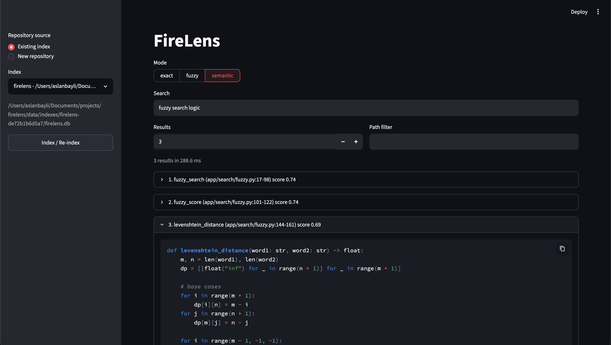

### ⚡ TL;DR
Coding agents fail partly because they retrieve code that is textually similar but structurally irrelevant. FireLens combines lexical, semantic, and repository-graph signals to retrieve the smallest context needed to complete a task.

# 🔥 FireLens

FireLens is a retrieval and inference benchmark for AI coding agents, with hybrid code search, graph-aware retrieval, MCP integration, and Mojo-accelerated hot paths.

It indexes repository symbols, semantic chunks, and embeddings into SQLite so
code can be retrieved with exact, fuzzy, lexical, semantic, or hybrid search.
FireLens is not a chatbot. Retrieval and indexing are the product.


## Current scope

- Python-only parsing via the standard library `ast` module
- SQLite-backed repository index storage
- exact symbol-name search
- fuzzy symbol-name search using normalized Levenshtein similarity
- SQLite FTS5 lexical search with exact-name, path, identifier, BM25, and
  typo-recovery evidence
- semantic code search using normalized vector similarity
- explicit reciprocal-rank-fusion and normalized-weighted hybrid modes
- stable symbol/chunk deduplication, result provenance, and component timings
- optional Mojo CPU kernels for fuzzy scoring and large semantic rankings
- exact-first automatic routing across exact, fuzzy, and semantic search
- local STDIO MCP tools for coding agents
- JSON CLI for indexing, freshness checks, and search
- Streamlit interface for indexing and all search modes
- Incremental reindexing based on file content changes
- Embedding reuse when chunk content has not changed
- Atomic index replacement after successful indexing
- Cross-process index/read locking for CLI, Streamlit, and MCP
- Bounded snippets and repository allowlists for agent-safe retrieval
- Root `.gitignore` support during repository walking
- configurable per-file and repository file-count limits
- Optional progress callbacks for indexing status updates

## Requirements

- Python `>=3.14,<3.15`
- [uv](https://docs.astral.sh/uv/getting-started/installation/)
- Mojo `1.0.0` only when building the optional acceleration library

For real semantic embeddings, install project dependencies and provide a
Hugging Face token in `.env` or the shell as `HF_TOKEN` if the model requires
authentication. FireLens loads `.env` only from its own checkout; a source
directory being indexed cannot override MCP configuration with its own `.env`.
Source checkouts store indexes under `data/indexes` by default. Installed
packages use the current user's platform data directory instead; set
`FIRELENS_DATA_DIR` when you want an explicit location.

## Install

```bash
git clone https://github.com/aslanbayli/firelens.git
cd firelens
uv sync
```

Legacy GitHub/chat modules are excluded from the default environment. Install
their old dependencies only when maintaining that compatibility code:

```bash
uv sync --extra legacy
```

## Optional Mojo acceleration

The default installation remains Python-only. To install the pinned Mojo
compiler and build the optional CPU shared library:

```bash
uv sync --extra mojo
uv run --extra mojo python scripts/build_mojo.py
```

The build is written atomically to `build/mojo/libfirelens_mojo.dylib` on
macOS or `build/mojo/libfirelens_mojo.so` on Linux. FireLens discovers that
path automatically. Set `FIRELENS_MOJO_LIBRARY_PATH` to load a library from a
different path; its ABI version is checked before any kernel runs.

Backend preferences behave as follows:

- `auto` uses Mojo for fuzzy batches with at least four candidates and semantic
  indexes with at least 30,000 rows, then falls back to Python if a native
  operation fails.
- `python` always uses the reference Python/NumPy compute path.
- `mojo` requires the shared library and forces Mojo for fuzzy and semantic
  compute, including below the automatic crossover sizes.
- Exact search remains an indexed SQLite query. The native exact kernel is
  available to benchmarks but is intentionally not in production routing; an
  explicit `mojo` exact request reports that limitation instead of silently
  changing backends.

The automatic crossover sizes can be tuned with
`FIRELENS_MOJO_FUZZY_MIN_CANDIDATES` and
`FIRELENS_MOJO_SEMANTIC_MIN_CANDIDATES`. Benchmark the local machine before
changing them:

```bash
uv run python -m benchmarks --profile full --comparison-backend mojo \
  --output build/benchmarks/full.json \
  --table-output build/benchmarks/full.md
```

See [the benchmark guide](benchmarks/README.md), the checked-in
[CPU baseline](benchmarks/CPU_BASELINE.md), and the conditional
[GPU gate](benchmarks/GPU_GATE.md) for the measurement and parity policy.

## Use the CLI

Indexing is explicit. Check status, build or refresh the index when needed, and
then search it:

```bash
uv run firelens status ~/projects/firelens
uv run firelens index ~/projects/firelens
uv run firelens search ~/projects/firelens "SQLiteIndexStore" --mode auto
uv run firelens search ~/projects/firelens "where are indexes persisted?" \
  --mode semantic --top-k 5 --path app/storage
uv run firelens search ~/projects/firelens "where is authentication checked?" \
  --mode hybrid_rrf --top-k 5
```

Commands write structured JSON to stdout. Indexing progress and errors go to
stderr, so stdout remains safe to pipe into another program.

`--mode` accepts `auto`, `exact`, `fuzzy`, `lexical`, `semantic`,
`hybrid_rrf`, and `hybrid_weighted`. `auto` intentionally retains its
exact/fuzzy/semantic routing behavior; select a hybrid mode explicitly until
evaluation data supports a calibrated default.

## Retrieval modes and hybrid behavior

`lexical` combines bounded exact qualified-name, exact short-name, path,
identifier, BM25, and fuzzy-symbol candidate channels. Results retain the
matching channels, normalized scores, and ranks so callers can see why a
result matched.

`semantic` ranks persisted code and documentation chunks by normalized vector
similarity. It supports the same path filter as lexical retrieval.

The two explicit hybrid modes generate bounded lexical and semantic pools from
the same index snapshot, deduplicate matching records, symbols, and equivalent
source spans, then apply a stable source-location tie break:

- `hybrid_rrf` uses weighted reciprocal rank fusion. Its public scores are
  normalized only after ranking.
- `hybrid_weighted` min-max normalizes each source per query, then combines the
  normalized values with configured lexical and semantic weights.

Hybrid results include the fusion method, final score, lexical and semantic
ranks and scores when present, inherited lexical evidence, per-component
backend, and candidate-generation/fusion timings. An explicitly selected
hybrid mode requires semantic retrieval: a semantic backend failure is
reported as an error rather than silently returning lexical-only results.

Defaults use pools of 20 lexical and 20 semantic candidates. Configure them
with `FIRELENS_HYBRID_LEXICAL_POOL_SIZE` and
`FIRELENS_HYBRID_SEMANTIC_POOL_SIZE`; the final result count remains controlled
by `--top-k`. RRF controls are `FIRELENS_HYBRID_RRF_K`,
`FIRELENS_HYBRID_RRF_LEXICAL_WEIGHT`, and
`FIRELENS_HYBRID_RRF_SEMANTIC_WEIGHT`. Weighted fusion uses
`FIRELENS_HYBRID_WEIGHTED_LEXICAL_WEIGHT`,
`FIRELENS_HYBRID_WEIGHTED_SEMANTIC_WEIGHT`, and
`FIRELENS_HYBRID_WEIGHTED_MISSING_SOURCE_VALUE`.

## Use FireLens as an MCP server

FireLens exposes `index_repository`, `get_index_status`, and `search_code` over
local STDIO. The server is silent on human-readable stdout because stdout is
the MCP protocol stream. Start it directly when testing the process:

```bash
FIRELENS_ALLOWED_ROOTS=/absolute/path/to/repositories \
FIRELENS_DATA_DIR=/absolute/path/to/firelens-data \
uv run --project /absolute/path/to/firelens firelens-mcp
```

Keep the process running and connect an MCP client to its stdin/stdout; do not
type commands into the terminal. A model-free contract test is available:

```bash
uv run python -m unittest \
  tests.test_interfaces.McpStdioContractTests.test_stdio_server_lifecycle_with_real_services_and_fake_embedder -v
```

`FIRELENS_ALLOWED_ROOTS` controls which repositories an agent may index or
search. Separate macOS/Linux roots with `:` and Windows roots with `;`.
`FIRELENS_DATA_DIR` is the parent directory for persisted indexes; each
repository database is stored below a sanitized repository name and a hash of
its canonical absolute path. All clients share an index when they use the same
data directory and canonical repository path. Use absolute paths in client
configuration, and keep the data directory outside the source roots.

The normal agent workflow is: call `get_index_status`, call
`index_repository` when the status is `missing` or `stale`, then call
`search_code`. The first semantic index can download and initialize
CodeRankEmbed; set a generous tool timeout and provide `HF_TOKEN` when the
model requires authentication.

## Connect Codex through MCP

FireLens exposes `index_repository`, `get_index_status`, and `search_code` over
local STDIO. Add this configuration to `~/.codex/config.toml`, or to
`.codex/config.toml` inside a trusted project, using absolute paths:

```toml
[mcp_servers.firelens]
command = "uv"
args = [
  "run",
  "--project",
  "/absolute/path/to/firelens",
  "firelens-mcp",
]
startup_timeout_sec = 30
tool_timeout_sec = 600
env_vars = ["HF_TOKEN"]

[mcp_servers.firelens.env]
FIRELENS_ALLOWED_ROOTS = "/absolute/repo/one:/absolute/repo/two"
FIRELENS_DATA_DIR = "/absolute/path/to/firelens/data/indexes"
```

For multiple allowed source directories on macOS or Linux, separate roots with
`:`, and use `;` on Windows. A root can be any local source directory; it does
not need to be a Git checkout. Symlinks are resolved before the allowlist
check, and symlinked source files are not indexed.

You can alternatively create the basic entry from a shell:

```bash
codex mcp add firelens \
  --env FIRELENS_ALLOWED_ROOTS=/absolute/path/to/repositories \
  --env FIRELENS_DATA_DIR=/absolute/path/to/firelens/data/indexes \
  -- uv run --project /absolute/path/to/firelens firelens-mcp
```

The registration command does not set tool timeouts. After running it, edit the
generated `mcp_servers.firelens` entry and add `startup_timeout_sec = 30` and
`tool_timeout_sec = 600` as shown above. Confirm registration with
`codex mcp list`; inside Codex, `/mcp` shows the connected tools. Restart Codex
after changing MCP configuration.

The intended agent workflow is:

1. Call `get_index_status`.
2. Call `index_repository` when status is `missing` or `stale`.
3. Call `search_code` for bounded code context.

`search_code` deliberately does not scan for file changes. This keeps queries
fast and predictable; freshness is an explicit status operation. The first
index may download and initialize CodeRankEmbed, so the example configuration
allows a ten-minute tool timeout. If the semantic model cannot load, indexing
fails without replacing the previous valid database.

MCP cancellation is cooperative. FireLens waits for the worker to release its
repository lease, database lock, and staged files before returning a cancelled
request; model encoding and NumPy operations stop at their next safe boundary.

## Connect Pi through MCP

Pi's MCP support is provided by the `pi-mcp-extension` package. Install it
once, then create `.pi/mcp.json` in a project or `~/.pi/agent/mcp.json` for a
user-wide connection:

```bash
pi install npm:pi-mcp-extension
```

```json
{
  "mcpServers": {
    "firelens": {
      "command": "uv",
      "args": [
        "run",
        "--project",
        "/absolute/path/to/firelens",
        "firelens-mcp"
      ],
      "transport": "stdio",
      "lifecycle": "eager",
      "env": {
        "FIRELENS_ALLOWED_ROOTS": "/absolute/path/to/repositories",
        "FIRELENS_DATA_DIR": "/absolute/path/to/firelens-data"
      }
    }
  }
}
```

Start Pi in the configured project and use `/mcp` to inspect the server. If it
is configured for lazy startup, `/mcp:start firelens` starts it explicitly.

## Connect Claude Code through MCP

Claude Code can register the local server from its CLI. Options must come
before the server name, and `--` separates Claude's arguments from the command
used to start FireLens:

```bash
claude mcp add --transport stdio \
  --env FIRELENS_ALLOWED_ROOTS=/absolute/path/to/repositories \
  --env FIRELENS_DATA_DIR=/absolute/path/to/firelens-data \
  firelens -- \
  uv run --project /absolute/path/to/firelens firelens-mcp
```

Check it with `claude mcp list` or `claude mcp get firelens`; inside Claude
Code, `/mcp` shows connection status and available tools. For a shareable
project-scoped setup, put this in `.mcp.json` at the project root instead:

```json
{
  "mcpServers": {
    "firelens": {
      "type": "stdio",
      "command": "uv",
      "args": [
        "run",
        "--project",
        "/absolute/path/to/firelens",
        "firelens-mcp"
      ],
      "env": {
        "FIRELENS_ALLOWED_ROOTS": "/absolute/path/to/repositories",
        "FIRELENS_DATA_DIR": "/absolute/path/to/firelens-data",
        "HF_TOKEN": "${HF_TOKEN}"
      }
    }
  }
}
```

Claude Code asks for approval before using a project-scoped `.mcp.json`.
Restart or reload the harness after changing its MCP configuration.

## Run the Streamlit interface

```bash
uv run streamlit run app/client/streamlit_app.py --server.fileWatcherType none
```

In the sidebar:

1. Select an existing index or enter a new repository path.
2. Click **Index / Re-index** when the repository needs indexing.
3. Choose `auto`, `exact`, `fuzzy`, `lexical`, `semantic`, `hybrid_rrf`, or
   `hybrid_weighted`, then select a compute backend.
4. Enter a query and optionally restrict it to a repository-relative file or
   directory prefix.

Use exact search for known symbol names, fuzzy search for partial or misspelled
identifiers, lexical search for text, identifier, or path matches, and semantic
or hybrid search for natural-language questions such as:

```text
fuzzy search logic
```



## Index a repository

Use the persisted indexer entrypoint:

```python
from app.indexing.embedder import CodeRankEmbedder
from app.indexing.indexer import index_to_sqlite

report = index_to_sqlite(
    "~/projects/firelens",
    CodeRankEmbedder(),
)

print(report.database_path)
```

This creates a SQLite database under:

```text
data/indexes/<repository-key>/firelens.db
```

The index contains:

- `repositories`: repository metadata and embedding compatibility info
- `files`: indexed file metadata and content hashes
- `symbols`: parsed functions, classes, and methods
- `chunks`: semantic-search source chunks
- `embeddings`: serialized embedding vectors
- `lexical_documents`: FTS5-backed lexical records for symbols, chunks, and
  documentation

## Incremental indexing

Reindexing the same repository does not rebuild everything.

FireLens now:

- reuses the same persisted repository identity
- hashes current files and compares them to stored file metadata
- parses and embeds only added or changed files
- removes records for deleted files
- reuses stored embeddings when chunk content hashes still match
- preserves previous valid records if a changed file fails parsing
- stages all database changes and atomically promotes a successful index
- writes changed files to the private snapshot one at a time to bound memory
- coordinates readers and indexers across FireLens processes with adjacent
  `firelens.db.lock` and `firelens.db.lock.intent` files

Clicking **Index / Re-index** in Streamlit uses this incremental behavior.
Unchanged files are not parsed or embedded again. To force a complete rebuild,
move or remove the existing `firelens.db` and index the repository again.

## Progress reporting

`index_to_sqlite()` accepts an optional `progress_callback` so callers can
render indexing progress in a CLI, Streamlit UI, or logs.

```python
from app.indexing.embedder import CodeRankEmbedder
from app.indexing.indexer import index_to_sqlite

def show_progress(event):
    print(f"[{event.stage}] {event.current}/{event.total} {event.message}")

report = index_to_sqlite(
    "~/projects/firelens",
    CodeRankEmbedder(),
    progress_callback=show_progress,
)
```

Progress stages currently include:

- `model`
- `load`
- `walk`
- `compare`
- `index`
- `parse`
- `embed`
- `write`
- `promote`
- `complete`

## `.gitignore` behavior

If the indexed repository contains a root `.gitignore`, FireLens excludes
matching paths while walking the tree. The current implementation supports the
common cases needed for repository indexing:

- comments and blank lines
- directory rules such as `build/`
- anchored rules such as `/generated.py`
- glob rules such as `*.generated.py`
- negation rules such as `!keep.py`

The root `.gitignore` is limited to 512 active rules.

FireLens also ignores built-in paths such as `.git`, virtualenv directories,
`node_modules`, and Python caches. Its root `data/` directory is reserved for
local indexes; nested source packages such as `app/data/` remain indexable.

By default, the walker skips source files larger than one megabyte and rejects
repositories containing more than 10,000 accepted source files. It also stops
after scanning 100,000 directory entries and limits each source file to 2,048
semantic chunks. Configure these caps with `FIRELENS_MAX_FILE_SIZE_BYTES`,
`FIRELENS_MAX_REPOSITORY_FILES`, `FIRELENS_MAX_WALK_ENTRIES`, and
`FIRELENS_MAX_CHUNKS_PER_FILE`.

Search also has hard candidate and memory bounds. Fuzzy ranking accepts at
most 512 symbol candidates; semantic search accepts at most 50,000 chunks
and 192 MiB of vector data. Narrow the path filter when a repository exceeds a
bound. The defaults can be reduced with `FIRELENS_MAX_FUZZY_CANDIDATES`,
`FIRELENS_MAX_SEMANTIC_CANDIDATES`, and
`FIRELENS_MAX_SEMANTIC_INDEX_BYTES`. Hybrid candidate pools are independently
bounded to 20 results per source before fusion, while final snippets and total
context still use the normal output limits.

## Embeddings

The real semantic embedder is `CodeRankEmbedder`, which loads:

```text
nomic-ai/CodeRankEmbed@3c4b60807d71f79b43f3c4363786d9493691f8b1
```

through `sentence-transformers`. Pinning the Hugging Face revision keeps remote
custom code and vector identity reproducible.

Override `FIRELENS_EMBEDDING_MODEL` only with a compatible model that follows
the same code-search query instruction contract, and set
`FIRELENS_EMBEDDING_REVISION` to an immutable commit for that model. Changing
the configured provider, model, or revision marks the existing index stale.
Set `FIRELENS_EMBEDDING_DIMENSION` to the model's output size. Changing that
value marks an existing index stale, and a vector-dimension mismatch discovered
during indexing fails before the staged database can replace a valid index.

Code chunks are embedded as documents. Natural-language queries receive the
CodeRank code-search instruction required by the model. Embeddings are
validated as finite, nonzero, normalized vectors before being stored.

The model runs locally through PyTorch. On Apple Silicon, that typically means
`mps` when available, otherwise CPU. Model files are cached by Hugging Face in
the user cache directory unless overridden by environment variables such as
`HF_HOME` or `TRANSFORMERS_CACHE`.

For tests and pipeline validation, `FakeEmbedder` provides deterministic
normalized vectors without requiring any model downloads.

## Semantic search behavior

Semantic search:

1. loads persisted chunk vectors and source metadata;
2. embeds and normalizes the query;
3. calculates cosine similarity with the selected Python or Mojo backend;
4. selects stable top-k score indexes from highest to lowest;
5. maps the selected indexes back to source chunks;
6. returns the requested top-k results.

Stored vectors are already normalized, so the query path does not renormalize
the matrix. Each compute backend still validates its array boundary before
ranking. Raw cosine similarity is mapped from `-1–1` to the public `0–1`
result-score range.

FireLens currently returns top-k semantic results without a minimum threshold.
The displayed score is a ranking signal, not calibrated probability or
confidence. Add a threshold only after evaluating raw cosine-score
distributions on representative queries and expected results.

## Inspect the SQLite index

```bash
sqlite3 data/indexes/<repository-key>/firelens.db
```

Useful queries:

```sql
.tables

SELECT COUNT(*) FROM files;
SELECT COUNT(*) FROM symbols;
SELECT COUNT(*) FROM chunks;
SELECT COUNT(*) FROM embeddings;

SELECT name, qualified_name, kind, relative_path, start_line, end_line
FROM symbols
LIMIT 20;
```

## Run tests

```bash
uv run python -m unittest discover -s tests -v
```

## Near-term gaps

- semantic-search quality evaluation and threshold calibration
- module-level semantic chunks for imports, constants, and executable code
- GPU semantic acceleration after a compatible toolchain passes the gate
- Only Python repositories are parsed today.
- `.gitignore` support is intentionally lightweight and limited to the root
  `.gitignore` file.
